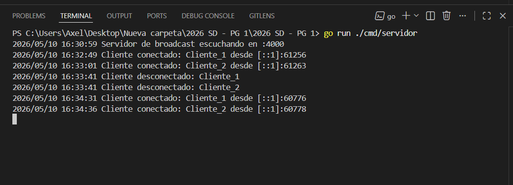
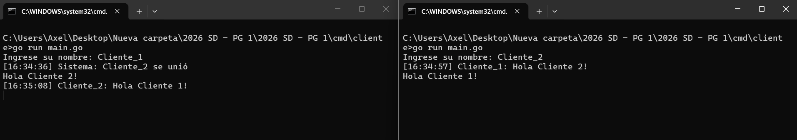
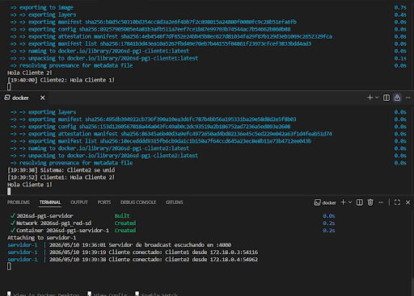
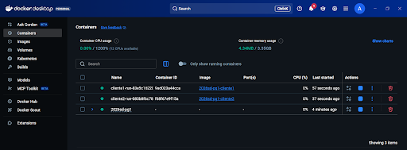

# Servidor de Broadcast Concurrente

Proyecto base para la Clase sobre Sockets de Sistemas Distribuidos.

## Integrantes

- Dos Santos Axel Joan
- Mittelstedt Gabriel Leonardo
- Escalada Leandro Ezequiel

## Ejecución

### Local

```bash
# Terminal 1: servidor
go run ./cmd/servidor

# Terminal 2: cliente
go run ./cmd/cliente
```

### Docker Compose

```bash
docker-compose up --build
```

## Requisitos completados

- [X] Servidor TCP concurrente
- [X] Protocolo JSON
- [X] Registro de clientes con sync.RWMutex
- [X] Broadcast a todos los clientes
- [X] Cliente interactivo (stdin + recepción paralela)
- [X] Docker + docker-compose
- [ ] Bonus: descubrimiento UDP

## Captura de ejecución
El servidor TCP se inicia correctamente y queda escuchando en el puerto configurado (por defecto 4000). Se observa el mensaje de arranque y el estado estable antes de que los clientes se conecten, confirmando que el proceso de escucha esta activo.


Clientes levantados de forma independiente con nombre asignado. En la captura se aprecia que las conexiones se establecen sin errores y que cada cliente queda listo para enviar/recibir mensajes en paralelo.


Prueba completa de broadcast con tres terminales: servidor en ejecucion y dos clientes activos. Un mensaje enviado por un cliente se propaga a los demas, validando la concurrencia del servidor, el protocolo JSON y la recepcion paralela en el cliente.


Ejecucion con Docker Compose levantando los servicios definidos (servidor y clientes) en una red compartida. La imagen evidencia el build, el arranque de contenedores y la comunicacion entre ellos sin configuracion manual de IP/puerto.
