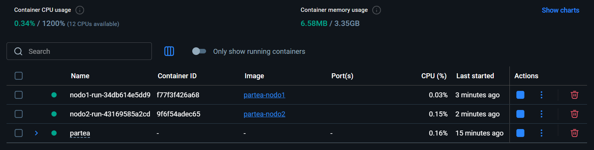
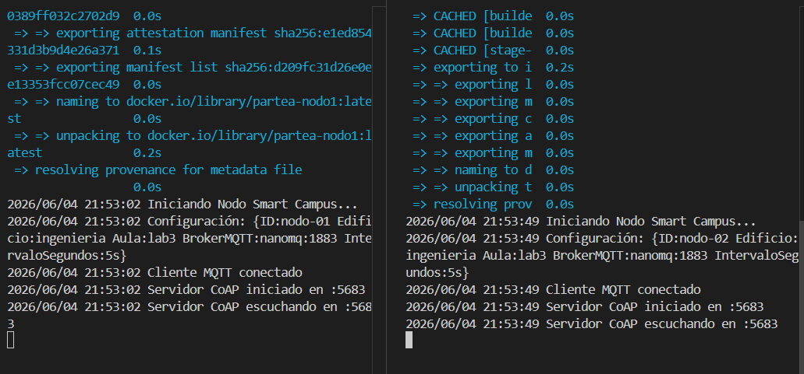
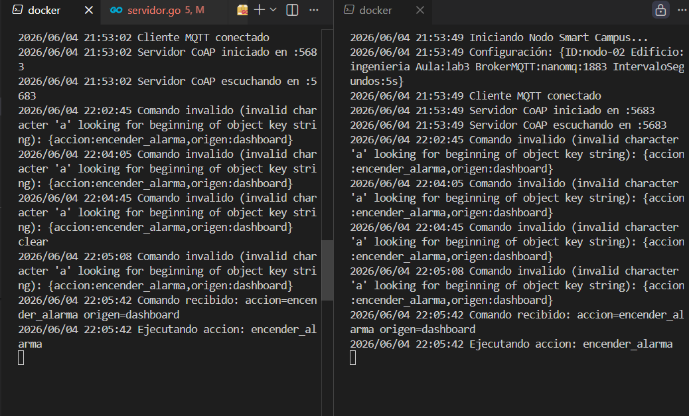
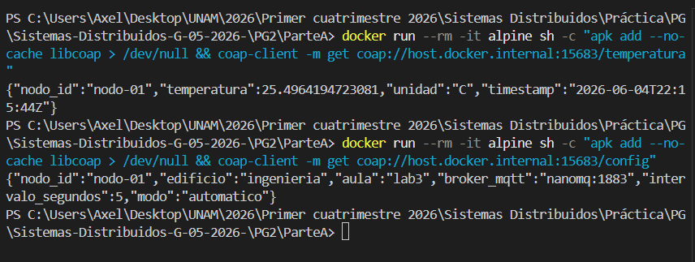
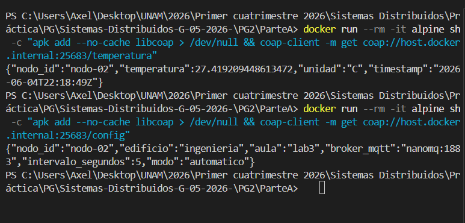

# Nodo IoT Smart Campus

Proyecto base para la parte A de la Practica Guiada 2: comunicacion MQTT + CoAP.

## Integrantes

- Dos Santos Axel Joan
- Escalada Leandro Ezequiel
- Mittelstedt Gabriel Leonardo

## Ejecucion

### Local

Requisito: broker MQTT corriendo en `localhost:1883` (puede ser NanoMQ local).

```bash
# Terminal 1: Broker (si no tienes uno local)
make broker-up

# Terminal 2: Nodo
make run
```

### Docker Compose (interactivo)

**1. Levantar solo el broker** (en background):
```bash
make broker-up
```

**2. Lanzar nodos** (en terminales separadas):
```bash
# Terminal 2: Nodo 1
make docker-nodo1

# Terminal 3: Nodo 2
make docker-nodo2
```

**3. Ver logs del broker o nodos**:
```bash
make docker-logs
```

**4. Detener todo**:
```bash
make broker-down
```

## Requisitos completados

- [x] Cliente MQTT con testamento (LWT): `nodo/{id}/estado` -> `{"estado":"offline"}`
- [x] Publicar estado `{"estado":"online"}` retenido tras conectar
- [x] Loop de lecturas simuladas cada 5 s en `campus/{edificio}/{aula}/sensor/temperatura` con QoS 1
- [x] Suscripcion a comandos en `campus/{edificio}/{aula}/actuador/cmd` con accion impresa
- [x] Servidor CoAP con recursos:
  - [x] `GET /temperatura` -> ultima lectura en JSON
  - [x] `PUT /config` -> actualizar configuracion local
  - [x] `GET /config` -> configuracion actual en JSON
- [x] Docker Compose con al menos 1 nodo + NanoMQ broker

## Captura de ejecucion

_(Adjuntar log o captura de pantalla con multiples nodos publicando y respondiendo CoAP)_

Docker Compose con broker y nodos en ejecucion.



Logs de nodos publicando telemetria.



Comando MQTT recibido y ejecutado por el nodo.



Respuestas CoAP del nodo 1.



Respuestas CoAP del nodo 2.

