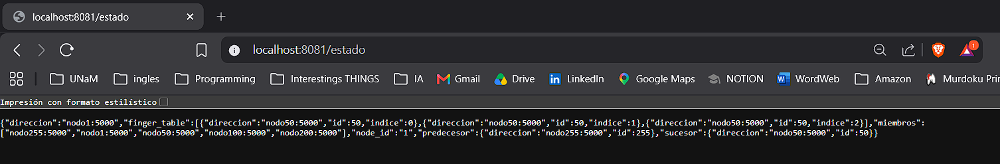
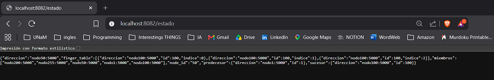
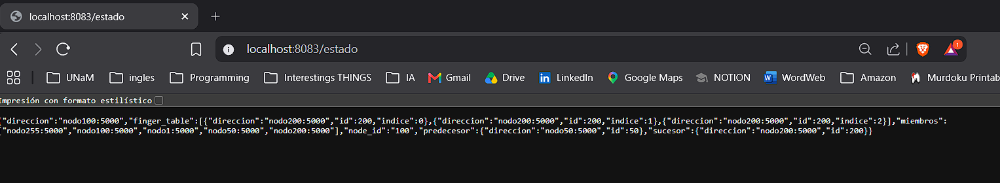
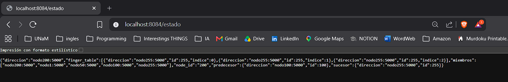
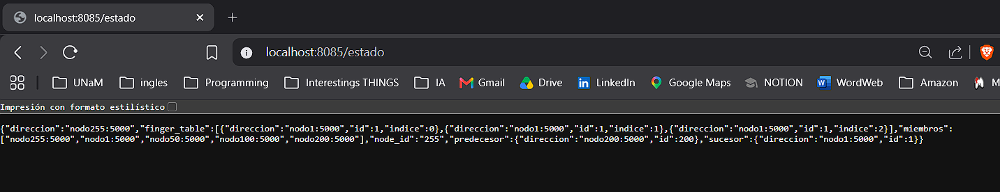
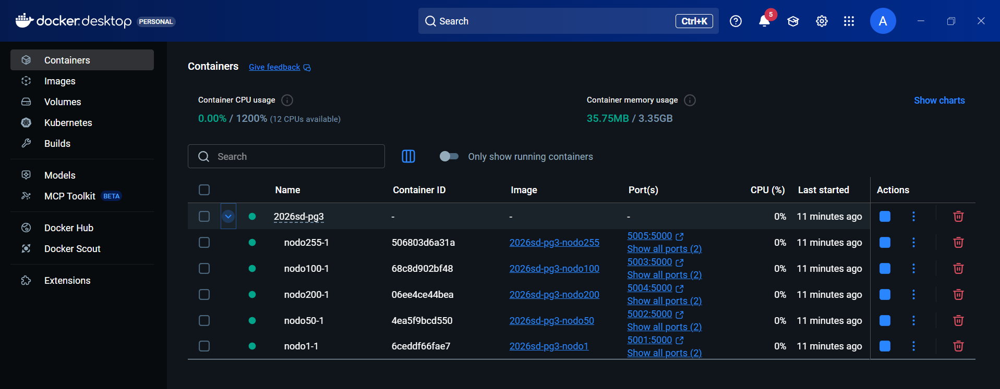

# Servicio de Descubrimiento P2P

Proyecto base para la Practica Guiada 3: Gossip + DHT Chord simplificado.

## Objetivo

Nodo que ejecuta Gossip (membresía P2P) + DHT Chord (lookup distribuido) simultáneamente.

## Integrantes

- Dos Santos Axel Joan
- Mittelstedt Gabriel Leonardo
- Escalada Ezequiel Leandro

## Ejecucion

### Local (un nodo)

```bash
# Nodo seed
NODO_ID=1 HTTP_PORT=8080 RPC_PORT=5000 go run ./cmd/nodo

# Nodo que se une al seed
NODO_ID=50 HTTP_PORT=8081 RPC_PORT=5001 SEED=localhost:5000 go run ./cmd/nodo
```

### Docker Compose (5 nodos)

```bash
make build
make run
make status
make logs
make stop
```

## Pruebas manuales

### Ver estado
```bash
curl http://localhost:8081/estado
```

### Almacenar un valor en el DHT
```bash
# clave 1: responsable = nodo 1 (rango (255, 1])
curl -X POST http://localhost:8081/almacenar \
  -H "Content-Type: application/json" \
  -d '{"clave":1,"valor":"hola"}'
```

### Buscar un valor en el DHT
```bash
curl "http://localhost:8081/buscar?clave=1"
```

### Probar lookup cross-nodo (forwarding por finger table)

```bash
# clave 25: responsable = nodo 50 (rango (1, 50])
# Pedir al nodo 1 que almacene: forwardeará al nodo 50 por RPC.
curl -X POST http://localhost:8080/almacenar \
  -H "Content-Type: application/json" \
  -d '{"clave":25,"valor":"mundo"}'

# Buscar desde el nodo 1: forwardeará al nodo 50.
curl "http://localhost:8080/buscar?clave=25"
```

### Verificar estabilización del anillo Chord

```bash
# Arrancar un tercer nodo (NODO_ID=100) sin añadirlo a PEERS de los otros
# dos, solo vía SEED. Gossip lo descubrirá; en hasta 10 s el bucle de
# estabilización Chord lo integrará al anillo.
NODO_ID=100 HTTP_PORT=8082 RPC_PORT=5002 SEED=localhost:5000 go run ./cmd/nodo

# Tras ~10 s, el /estado del nodo 1 debería mostrar finger_table
# apuntando al nuevo sucesor/predecesor del anillo completo.
curl http://localhost:8080/estado
```

## Requisitos completados

- [x] TODO 1-7: Gossip - membresia, anti-entropia (`pkg/gossip/nodo.go`)
- [x] TODO 8-14: DHT - finger table, lookup (`pkg/dht/chord.go`)
- [x] TODO 15-20: Nodo HTTP + RPC (`cmd/nodo/main.go`)
- [x] Docker Compose con 5 nodos

## Captura de ejecución

### Nodo 1


### Nodo 2


### Nodo 3


### Nodo 4


### Nodo 5


### Docker Compose


### Convergencia de Gossip y estabilización Chord (logs nodo1)

```
[NODO 1] Chord init: anillo=[1 50 100 200 255] pred=255 suc=50
[NODO 1] Gossip anti-entropía con nodo50:5000 → miembros conocidos: [nodo1:5000 nodo50:5000 nodo100:5000 nodo200:5000 nodo255:5000]
[NODO 1] Estabilización Chord: anillo=[1 50 100 200 255] pred=255 suc=50
[NODO 1] Gossip anti-entropía con nodo200:5000 → miembros conocidos: [nodo1:5000 nodo50:5000 nodo100:5000 nodo200:5000 nodo255:5000]
[NODO 1] Estabilización Chord: anillo=[1 50 100 200 255] pred=255 suc=50
```

### GET /estado nodo1

```json
{
  "node_id": "1",
  "direccion": "nodo1:5000",
  "miembros": ["nodo1:5000", "nodo50:5000", "nodo100:5000", "nodo200:5000", "nodo255:5000"],
  "finger_table": [
    {"indice": 0, "id": 50, "direccion": "nodo50:5000"},
    {"indice": 1, "id": 50, "direccion": "nodo50:5000"},
    {"indice": 2, "id": 50, "direccion": "nodo50:5000"}
  ],
  "sucesor":    {"id": 50,  "direccion": "nodo50:5000"},
  "predecesor": {"id": 255, "direccion": "nodo255:5000"}
}
```

### Almacenar clave=1 desde nodo50 → forwardea a nodo1

```bash
curl -X POST http://localhost:8082/almacenar -H "Content-Type: application/json" -d '{"clave":1,"valor":"hola"}'
# {"clave":1,"nodo_id":1,"nodo_responsable":"nodo1:5000","ok":true}
```

### Buscar clave=1 desde nodo50

```bash
curl "http://localhost:8082/buscar?clave=1"
# {"clave":1,"encontrado":true,"nodo_id":1,"nodo_responsable":"nodo1:5000","valor":"hola"}
```

### Lookup cross-nodo: clave=25 desde nodo1 → forwardea a nodo50

```bash
curl -X POST http://localhost:8081/almacenar -H "Content-Type: application/json" -d '{"clave":25,"valor":"mundo"}'
# {"clave":25,"nodo_id":50,"nodo_responsable":"nodo50:5000","ok":true}

curl "http://localhost:8081/buscar?clave=25"
# {"clave":25,"encontrado":true,"nodo_id":50,"nodo_responsable":"nodo50:5000","valor":"mundo"}
```
